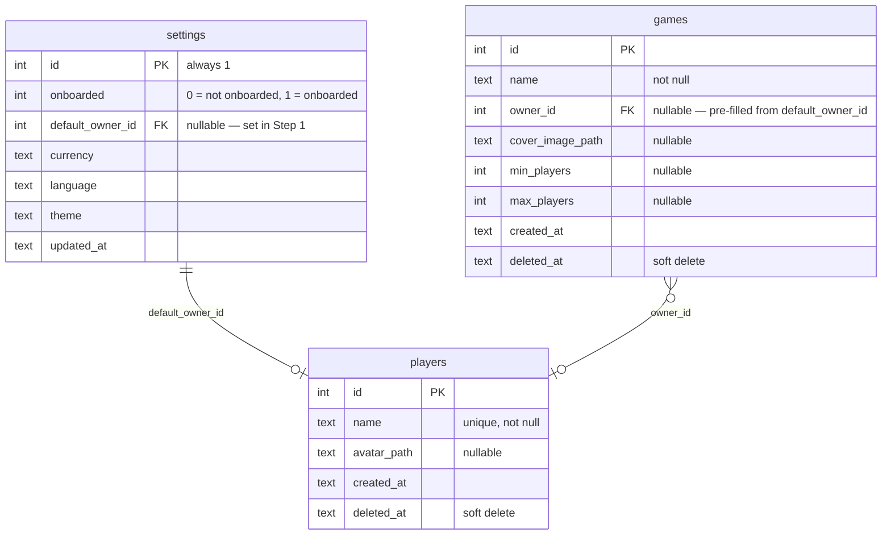

# ERD: Onboarding Flow

## Schema Delta

One new column. Everything else (reset transaction, FK safety via soft-deletes) is already handled.

**`server/src/db/migrations/0003_onboarding.sql`**
```sql
ALTER TABLE settings ADD COLUMN onboarded INTEGER NOT NULL DEFAULT 0;
```

**`server/src/db/schema.ts`** — settings table
```ts
onboarded: integer('onboarded').notNull().default(0),
```

**`server/src/routes/settings.ts`** — PUT handler must also accept `onboarded` (0 or 1).

---

## Entity Diagram



---

## Routing Rules

| `settings` state | Guard result |
|---|---|
| `onboarded = 0` | Any protected route → redirect `/onboarding` |
| `onboarded = 1` | `/onboarding` → redirect `/home` |
| `onboarded = 0` + `default_owner_id IS NOT NULL` | Resume at Step 2 (host already exists) |

Resume check: on `/onboarding` mount, if `default_owner_id` is non-null and the referenced player is not soft-deleted → open at Step 2, not Step 1.

---

## Per-Step Data Operations

| Step | Operations |
|---|---|
| **Step 1 — Host** | `POST /players { name }` → (optional) `POST /players/:id/avatar` → `PUT /settings { default_owner_id }` |
| **Step 2 — Friends** | 0+ × `POST /players { name }` — eager, one per "Add" click |
| **Step 3 — Games** | 0+ × `POST /games { name, owner_id: default_owner_id, … }` — eager, one per "Add Game" |
| **Complete** | `PUT /settings { onboarded: 1 }` → navigate `/home` |
| **Reset** | `DELETE /settings/reset` — wipes all tables + uploaded files, re-seeds settings (onboarded defaults to 0) |

---

## Resolved Holes

| Hole | Resolution |
|---|---|
| Mid-flow abandonment | `default_owner_id IS NOT NULL` → resume at Step 2; host is not recreated |
| FK safety on player delete | Soft-deletes + reset transaction handle this; no ON DELETE constraint change needed |
| Reset scope | Confirmed: clears settings, players, games, sessions, session_results, game_attachments, and all uploaded files atomically |
