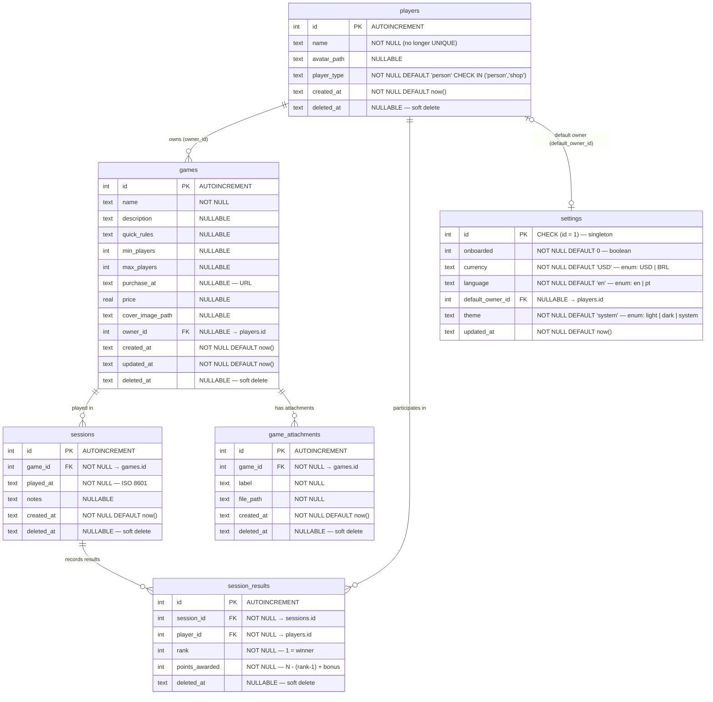

# Entity Relationship Document
## Tally — Player Types (Person vs. Shop)

**Version:** v4
**Status:** Draft
**Last Updated:** 2026-05-06
**Related PRD:** [players-prd.md](./players-prd.md)

---

## 1. Diagram



---

## 2. Entity Definitions

### 2.1 `players` ← **modified in v4**

| Column | Type | Constraints | Notes |
|--------|------|-------------|-------|
| `id` | INTEGER | PK, AUTOINCREMENT | |
| `name` | TEXT | NOT NULL | **Unique constraint dropped in v4** (see §4.1) |
| `avatar_path` | TEXT | NULLABLE | Relative path to uploaded avatar file |
| `player_type` | TEXT | NOT NULL, DEFAULT `'person'`, CHECK `IN ('person','shop')` | **New in v4** |
| `created_at` | TEXT | NOT NULL, DEFAULT now() | ISO 8601 |
| `deleted_at` | TEXT | NULLABLE | NULL = active; populated = soft-deleted |

**Constraints removed in v4:** `UNIQUE(name)` — player names are no longer globally unique; only `id` is the unique identifier.

**Business rules:**
- `player_type = 'shop'` players are excluded from leaderboards, H2H stats, and session player selection at the query level.
- `player_type = 'shop'` players may own games (`games.owner_id`) and be set as `settings.default_owner_id`.
- Soft-deleting a shop player leaves all `games.owner_id` and `settings.default_owner_id` references intact; callers handle missing/deleted players gracefully.
- The Session Logger's inline create-player shortcut always creates `player_type = 'person'`; the type selector is not shown there.

---

### 2.2 `games` — unchanged

| Column | Type | Constraints | Notes |
|--------|------|-------------|-------|
| `id` | INTEGER | PK, AUTOINCREMENT | |
| `name` | TEXT | NOT NULL | |
| `description` | TEXT | NULLABLE | |
| `quick_rules` | TEXT | NULLABLE | |
| `min_players` | INTEGER | NULLABLE | |
| `max_players` | INTEGER | NULLABLE | |
| `purchase_at` | TEXT | NULLABLE | URL |
| `price` | REAL | NULLABLE | |
| `cover_image_path` | TEXT | NULLABLE | |
| `owner_id` | INTEGER | NULLABLE, FK → `players.id` | Can reference any player type |
| `created_at` | TEXT | NOT NULL, DEFAULT now() | |
| `updated_at` | TEXT | NOT NULL, DEFAULT now() | |
| `deleted_at` | TEXT | NULLABLE | Soft delete |

**Indexes:** `idx_games_deleted_at (deleted_at)`, `idx_games_owner_id (owner_id)`

---

### 2.3 `game_attachments` — unchanged

| Column | Type | Constraints | Notes |
|--------|------|-------------|-------|
| `id` | INTEGER | PK, AUTOINCREMENT | |
| `game_id` | INTEGER | NOT NULL, FK → `games.id` | |
| `label` | TEXT | NOT NULL | |
| `file_path` | TEXT | NOT NULL | |
| `created_at` | TEXT | NOT NULL, DEFAULT now() | |
| `deleted_at` | TEXT | NULLABLE | Soft delete |

**Indexes:** `idx_attachments_game_id (game_id)`

---

### 2.4 `sessions` — unchanged

| Column | Type | Constraints | Notes |
|--------|------|-------------|-------|
| `id` | INTEGER | PK, AUTOINCREMENT | |
| `game_id` | INTEGER | NOT NULL, FK → `games.id` | |
| `played_at` | TEXT | NOT NULL | ISO 8601 |
| `notes` | TEXT | NULLABLE | |
| `created_at` | TEXT | NOT NULL, DEFAULT now() | |
| `deleted_at` | TEXT | NULLABLE | Soft delete |

**Indexes:** `idx_sessions_game_id (game_id)`

---

### 2.5 `session_results` — unchanged

| Column | Type | Constraints | Notes |
|--------|------|-------------|-------|
| `id` | INTEGER | PK, AUTOINCREMENT | |
| `session_id` | INTEGER | NOT NULL, FK → `sessions.id` | |
| `player_id` | INTEGER | NOT NULL, FK → `players.id` | |
| `rank` | INTEGER | NOT NULL | 1 = winner |
| `points_awarded` | INTEGER | NOT NULL | Calculated: N − (rank − 1); winner gets +1 bonus |
| `deleted_at` | TEXT | NULLABLE | Soft delete |

**Indexes:** `idx_results_session_id (session_id)`, `idx_results_player_id (player_id)`

**Note:** Existing session results that reference a shop player (historical data) are preserved and displayed in session detail views. They are excluded only from stat aggregation queries going forward.

---

### 2.6 `settings` — unchanged

| Column | Type | Constraints | Notes |
|--------|------|-------------|-------|
| `id` | INTEGER | PK, CHECK (`id = 1`) | Singleton row |
| `onboarded` | INTEGER | NOT NULL, DEFAULT `0` | Boolean (0/1) |
| `currency` | TEXT | NOT NULL, DEFAULT `'USD'` | Enum: `USD` \| `BRL` |
| `language` | TEXT | NOT NULL, DEFAULT `'en'` | Enum: `en` \| `pt` |
| `default_owner_id` | INTEGER | NULLABLE, FK → `players.id` | May reference a shop-type player |
| `theme` | TEXT | NOT NULL, DEFAULT `'system'` | Enum: `light` \| `dark` \| `system` |
| `updated_at` | TEXT | NOT NULL, DEFAULT now() | |

---

## 3. Relationships

| Relationship | Cardinality | FK Column | Nullable | Notes |
|---|---|---|---|---|
| `players` → `games` | 1 : N | `games.owner_id` | Yes | Any player type can own games |
| `players` → `session_results` | 1 : N | `session_results.player_id` | No | Historical shop results preserved |
| `players` → `settings` | 1 : 0..1 | `settings.default_owner_id` | Yes | Any player type can be default owner |
| `games` → `sessions` | 1 : N | `sessions.game_id` | No | |
| `games` → `game_attachments` | 1 : N | `game_attachments.game_id` | No | |
| `sessions` → `session_results` | 1 : N | `session_results.session_id` | No | |

---

## 4. Migration: `0004_player_type.sql`

### 4.1 Changes Required

Two changes to the `players` table in a single migration:

1. **Drop `UNIQUE(name)` constraint** — player names are no longer required to be unique. SQLite does not support `ALTER TABLE DROP CONSTRAINT`, so the table must be rebuilt via the rename pattern.
2. **Add `player_type` column** — `TEXT NOT NULL DEFAULT 'person' CHECK (player_type IN ('person', 'shop'))`.

### 4.2 Why Each Step Is Necessary

| Risk | Root cause | Mitigation in this migration |
|---|---|---|
| FK violation on `DROP TABLE players` | SQLite enforces FKs — other tables reference `players.id` | `PRAGMA foreign_keys = OFF` before drop; `ON` after rename |
| New IDs collide with old IDs after rebuild | `AUTOINCREMENT` tracks max-ever ID in `sqlite_sequence` keyed by table name; rename leaves a stale `players_new` entry | `UPDATE sqlite_sequence` after rename |
| Partial failure leaves DB in broken state | Steps 3–4 are destructive | Entire migration runs inside a single `BEGIN`/`COMMIT` transaction — any failure rolls back automatically |
| Indexes lost on drop | `DROP TABLE` removes all associated indexes | Recreate indexes explicitly after rename |

### 4.3 Complete Migration SQL

```sql
-- ============================================================
-- 0004_player_type.sql
-- Changes:
--   1. Remove UNIQUE(name) from players
--   2. Add player_type TEXT NOT NULL DEFAULT 'person'
--      CHECK (player_type IN ('person','shop'))
-- ============================================================

-- Must disable FK enforcement before dropping the old table.
-- Other tables (games, session_results, settings) reference players.id.
-- SQLite enforces FKs at statement level, not transaction level,
-- so this pragma must come BEFORE the transaction.
PRAGMA foreign_keys = OFF;

BEGIN;

-- Step 1: Create the replacement table.
-- Differences from the current players table:
--   - No UNIQUE constraint on name
--   - New player_type column with CHECK constraint and default
CREATE TABLE players_new (
    id          INTEGER PRIMARY KEY AUTOINCREMENT,
    name        TEXT    NOT NULL,
    avatar_path TEXT,
    player_type TEXT    NOT NULL
                        DEFAULT 'person'
                        CHECK (player_type IN ('person', 'shop')),
    created_at  TEXT    NOT NULL
                        DEFAULT (strftime('%Y-%m-%dT%H:%M:%fZ', 'now')),
    deleted_at  TEXT
);

-- Step 2: Copy every row from the old table.
-- Explicitly list columns — never use SELECT * in a table rebuild.
-- All existing players are backfilled as 'person'.
INSERT INTO players_new (id, name, avatar_path, player_type, created_at, deleted_at)
SELECT                   id, name, avatar_path, 'person',    created_at, deleted_at
FROM players;

-- Step 3: Verify row counts match before dropping anything.
-- This SELECT will cause the migration to fail (result mismatch) if
-- the INSERT above silently dropped rows. Keep this check in place.
SELECT CASE
    WHEN (SELECT COUNT(*) FROM players_new) = (SELECT COUNT(*) FROM players)
    THEN 'OK'
    ELSE RAISE(ABORT, 'Row count mismatch after copy — migration aborted')
END;

-- Step 4: Drop the old table.
-- Safe because PRAGMA foreign_keys = OFF is active.
DROP TABLE players;

-- Step 5: Rename the new table into place.
ALTER TABLE players_new RENAME TO players;

-- Step 6: Fix sqlite_sequence so AUTOINCREMENT continues from the
-- correct value. After the rename, the sequence entry is still keyed
-- to 'players_new'. Without this update, the next INSERT would find
-- no entry for 'players' and could reuse IDs.
UPDATE sqlite_sequence SET name = 'players' WHERE name = 'players_new';

-- Step 7: Recreate indexes (DROP TABLE removed them).
CREATE INDEX IF NOT EXISTS idx_players_deleted_at ON players (deleted_at);

COMMIT;

-- Re-enable FK enforcement.
PRAGMA foreign_keys = ON;
```

### 4.4 Post-Migration Verification Queries

Run these manually or in a test after applying the migration to confirm correctness.

```sql
-- 1. Confirm player_type column exists with the right default and check
SELECT name, type, dflt_value, "notnull"
FROM pragma_table_info('players')
WHERE name = 'player_type';
-- Expected: name=player_type, type=TEXT, dflt_value='person', notnull=1

-- 2. Confirm UNIQUE constraint is gone (should return no unique indexes on 'name')
SELECT name, "unique", origin
FROM pragma_index_list('players')
WHERE "unique" = 1;
-- Expected: zero rows (or only PK-related entries, not a name index)

-- 3. Confirm all rows were backfilled correctly
SELECT COUNT(*) AS total,
       SUM(CASE WHEN player_type = 'person' THEN 1 ELSE 0 END) AS persons,
       SUM(CASE WHEN player_type NOT IN ('person','shop') THEN 1 ELSE 0 END) AS invalid
FROM players;
-- Expected: total = persons, invalid = 0

-- 4. Confirm sqlite_sequence is correct
SELECT name, seq FROM sqlite_sequence WHERE name = 'players';
-- Expected: one row with name='players' (not 'players_new')

-- 5. Confirm FK references are intact
SELECT COUNT(*) FROM games         WHERE owner_id IS NOT NULL
  AND owner_id NOT IN (SELECT id FROM players);
SELECT COUNT(*) FROM session_results
  WHERE player_id NOT IN (SELECT id FROM players);
-- Expected: both return 0
```

### 4.5 Rollback

There is no automatic rollback once `COMMIT` succeeds. To undo manually:

1. Recreate `players` with `UNIQUE(name)` and without `player_type` using the same rename pattern.
2. Copy all rows back (the `player_type` column is simply omitted).
3. Update `sqlite_sequence` again.

All existing data survives — the only loss would be any `player_type = 'shop'` values set after the migration.

---

## 5. Query-Level Filtering Rules

These are not schema constraints but define how the new column is used across the API.

| Surface | Filter Applied | Endpoint |
|---|---|---|
| Global leaderboard | `WHERE player_type = 'person'` | `GET /api/v1/stats/leaderboard` |
| Per-game leaderboard | `WHERE player_type = 'person'` | `GET /api/v1/stats/leaderboard/game/:gameId` |
| H2H stats | Validate both player IDs are `person` type; 400 otherwise | `GET /api/v1/stats/head-to-head` |
| Session player selector (frontend) | Show only `player_type = 'person'` | Client-side filter on `/api/v1/players` response |
| H2H dropdowns (frontend) | Show only `player_type = 'person'` | Client-side filter on `/api/v1/players` response |
| Players page — People section | Filter `player_type = 'person'` | Client-side |
| Players page — Shops section | Filter `player_type = 'shop'` | Client-side |
| Game owner selector | All active players (any type) | No filter — shops are valid owners |
| Settings default owner selector | All active players (any type) | No filter — shops are valid default owners |

---

## 6. Drizzle ORM Schema Change

In `server/src/db/schema.ts`, the `players` table definition changes to:

```ts
export const players = sqliteTable('players', {
  id:          integer('id').primaryKey({ autoIncrement: true }),
  name:        text('name').notNull(),                // UNIQUE removed
  avatarPath:  text('avatar_path'),
  playerType:  text('player_type', { enum: ['person', 'shop'] })
                 .notNull()
                 .default('person'),                  // new field
  createdAt:   text('created_at').notNull().default(sql`(strftime('%Y-%m-%dT%H:%M:%fZ', 'now'))`),
  deletedAt:   text('deleted_at'),
});
```

---

*End of Document*
